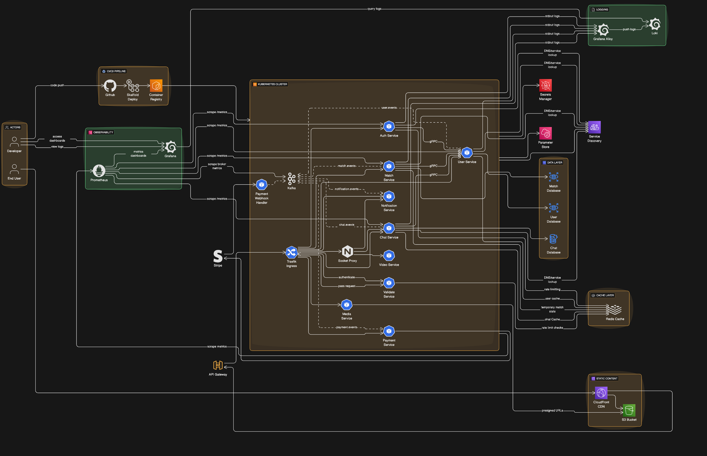

# i4you

i4you is a full‑stack, microservices‑based application for user profiles, matching, and real‑time chat — think of it as the backend and frontend foundation for a modern matchmaking/dating/social app. The repository is a monorepo that includes multiple backend services, a Next.js frontend, local and Kubernetes deployment tooling, and supporting infrastructure.

## At a glance
- Monorepo managed with pnpm and Turbo.
- Backend: multiple Node.js/TypeScript services (Express, NestJS, gRPC, Kafka) using MongoDB and Redis.
- Frontend: Next.js app (apps/frontend).
- Messaging/Streaming: Apache Kafka (via Strimzi in K8s).
- Search/Analytics: Elasticsearch with a worker service.
- Realtime: Socket.io gateway (chat service + nginx socket proxy).
- Orchestration: Kubernetes with Traefik Ingress, Skaffold profiles for local dev, and Helm‑managed dependencies.
- Observability: Grafana, Prometheus, Loki, Kiali (optional profile).
- Secrets: Vault (via Helm in the setup profile).
- IaC: Terraform files included for infra provisioning (non‑essential for local dev).

## Services and components
The main app services live under apps/services and are wired in skaffold.yaml and docker-compose.yaml:

- validate-service: Input/validation gateway used by other services.
- user-service: User profiles, persistence (MongoDB), and gRPC endpoints used by other services.
- auth-service: Authentication/authorization (talks to user-service via gRPC).
- media-service: Media handling for user content.
- match-service: Matching and recommendations.
- chat-service: Real-time chat/gateway (NestJS), backed by MongoDB and Socket.io.
- notification-service: Notifications delivery.
- moderation-service: Content moderation pipeline.
- discovery-service: Discovery/search endpoints.
- payment-service: Payment/webhook handling.
- es-worker-service: Elasticsearch indexing/worker processes.
- socket-proxy-nginx: Nginx configured for socket proxying.

Frontend: apps/frontend (Next.js) is exposed at the root path via Traefik in dev K8s.

Kubernetes manifests are under k8s/, with dev environment resources (namespaces, Traefik Ingress, Kafka, Redis, Elasticsearch, Grafana, etc.). Skaffold profiles orchestrate CRDs, setup dependencies, and services for local clusters. Docker Compose is provided for a lighter local run of a subset of services.

## Tech stack highlights
- Node.js + TypeScript across services.
- Express, NestJS, inversify (DI), Swagger for API docs, zod for validation.
- Kafka (kafkajs), Redis, MongoDB (mongoose).
- gRPC (@grpc/grpc-js, protobuf tooling) for service-to-service communication.
- Next.js frontend with TypeScript.
- Traefik as the ingress controller (host: i4you.local.net in dev), TLS via a local secret.
- Observability via Grafana/Loki/Prometheus (optional monitoring profile).

## How to run (local)
Choose one of the following approaches depending on your environment and needs.

### Option A: Kubernetes + Skaffold (recommended for full stack)
Prerequisites: Docker, a local K8s cluster (minikube/kind/colima), kubectl, helm, and skaffold.

1) Apply CRDs used by operators (Grafana, Prometheus, Strimzi, Traefik):
   skaffold run -p crds

2) Bootstrap core dependencies (namespaces, Kafka, Redis, Vault, Elasticsearch/Kibana, Traefik, monitoring):
   skaffold run -p setup

3) Build and deploy the application services and frontend:
   skaffold dev -p dev

- Services are exposed via Traefik at https://i4you.local.net
- Ingress routes map to /api/v1/* (auth, user, media, chat, match, moderation, payment) and / for the frontend.

### Option B: Docker Compose (subset)
Prerequisites: Docker and Docker Compose.

- Bring up core services defined in docker-compose.yaml:
  docker compose up --build

This will run validate-service, user-service, auth-service, media-service, chat-service, frontend, and an nginx proxy. Environment variables default to local MongoDB at host.docker.internal; see docker-compose.yaml for details.

## Repository layout
- apps/
  - services/… (all backend microservices)
  - frontend/ (Next.js application)
  - nginx/ (socket proxy config and certs for local dev)
- k8s/ (Kubernetes manifests for dev/prod and dependencies)
- skaffold.yaml (multi-profile config: crds, setup, dev, production, monitoring, istio)
- docker-compose.yaml (local compose for a subset of services)
- terraform*.tf / .terraform/ (Terraform state and providers)
- turbo.json, pnpm-workspace.yaml (monorepo tooling)

## Development notes
- Package manager: pnpm (see package.json for scripts). Example:
  pnpm run frontend            # run frontend dev
  pnpm run frontend:secure     # run frontend in secure mode

- Many services use TypeScript with tsx for local dev and tsc for builds.
- gRPC proto definitions are consumed via @i4you/proto-files.
- For local TLS and ingress, the host is configured as i4you.local.net; ensure your local DNS/hosts and certs align with the k8s/dev setup.

## Status
This repository is actively evolving. Some per-service READMEs are boilerplate. Refer to skaffold.yaml and k8s/dev manifests for the authoritative view of what runs in local dev.

## System design
- Location for diagrams and images:
  - Source diagrams live under docs/system-design/.
  - Exported assets (SVG/PNG) live under docs/system-design/assets/.
- Preferred formats:
  - Text-first: Mermaid (.mmd) or Mermaid code blocks inside Markdown for versionable diagrams.
  - Vector exports: .svg (preferred for crisp rendering and diffs).
  - Raster exports: .png (only when screenshots or raster imagery are needed).
- Naming conventions:
  - Use kebab-case and a short prefix for context, e.g. arch-overview.svg, seq-auth-login.svg, k8s-dev-topology.svg.
  - Optionally include a date or version suffix, e.g. arch-overview-2025-08.svg.
- How to embed in this README:
  - Mermaid (renders on GitHub):

  - Or embed an exported image:

- Authoring notes:
  - Keep the editable source (.mmd or .puml) next to the exported image so updates are easy.
  - When a platform doesn’t support Mermaid, prefer linking to or embedding the exported SVG.
  - For large diagrams, consider splitting into smaller topic-focused diagrams (e.g., auth, chat, matching, data pipelines).
